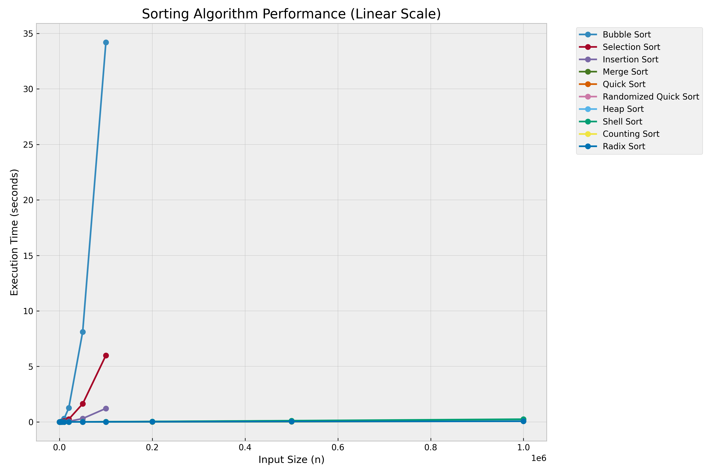
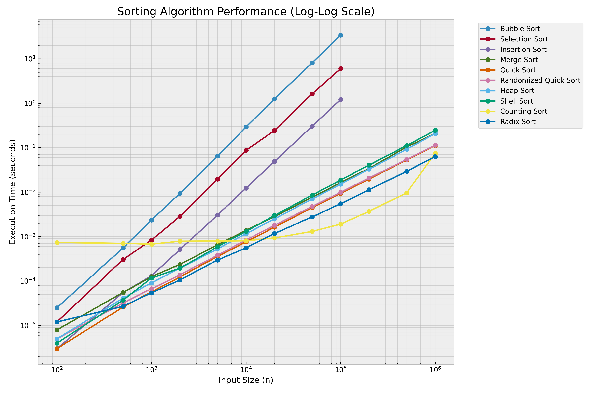
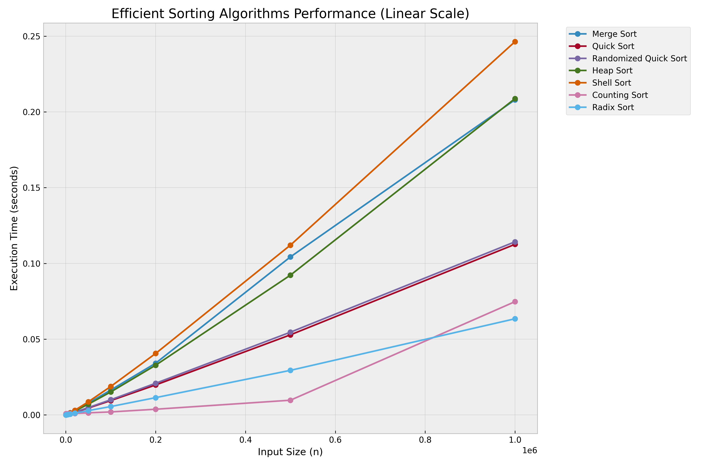

# Experimental Evaluation of Sorting Algorithms

## 1. Introduction
This report presents an experimental evaluation of various sorting algorithms implemented in C. The goal is to analyze their time complexity growth as the input size increases up to $10^6$ elements.

### 1.1 Algorithms Evaluated
The following sorting algorithms were included in the comparison:
- **$O(n^2)$ Complexity**: Bubble Sort, Selection Sort, Insertion Sort.
- **$O(n \log n)$ Complexity**: Merge Sort, Quick Sort, Randomized Quick Sort, Heap Sort, Shell Sort.
- **$O(n)$ / Linear Complexity**: Counting Sort, Radix Sort.

## 2. Methodology
- **Implementation**: All algorithms were refactored into a unified C benchmarking suite (`benchmark.c`).
- **Input Data**: Randomly generated integers in the range $[0, 1,000,000]$.
- **Input Scaling**: Sizes varied from 100 to 1,000,000. For $O(n^2)$ algorithms, testing was capped at 100,000 to keep execution time reasonable.
- **Timing**: High-resolution timing was performed using `clock_gettime(CLOCK_MONOTONIC)`.
- **Environment**: Compiled with `gcc -O3` for optimal performance.
- **Visualization**: Data was plotted using Python's Matplotlib library in both linear and log-log scales.

## 3. Results and Visualization

### 3.1 Overall Performance (Linear Scale)
The linear scale plot clearly demonstrates the dramatic performance gap between quadratic and sub-quadratic algorithms.

### 3.2 Complexity Analysis (Log-Log Scale)
The log-log scale is essential for identifying the power-law relationship between input size and execution time. In this scale, the slope of the curve represents the exponent of the time complexity.

### 3.3 Efficient Algorithms (Close-up)
A closer look at the $O(n \log n)$ and $O(n)$ algorithms reveals their scalability for large datasets.

## 4. Analysis and Conclusions

### 4.1 Quadratic Algorithms ($O(n^2)$)
- **Bubble Sort**, **Selection Sort**, and **Insertion Sort** exhibit a parabolic growth curve on the linear plot.
- On the log-log plot, these algorithms show a slope of approximately **2.0**, confirming their $O(n^2)$ theoretical complexity.
- These algorithms become impractical for input sizes exceeding $10^5$.

### 4.2 Sub-Quadratic Algorithms ($O(n \log n)$)
- **Merge Sort**, **Heap Sort**, and **Quick Sort** variants show significantly better scaling.
- **Randomized Quick Sort** demonstrates consistent performance even with larger datasets, avoiding the worst-case scenarios of standard Quick Sort.
- **Shell Sort** performs remarkably well, often comparable to $O(n \log n)$ algorithms for the tested range, despite having a theoretical complexity that depends on the gap sequence.

### 4.3 Linear Time Algorithms ($O(n)$)
- **Counting Sort** and **Radix Sort** exhibit the best performance.
- Their curves on the log-log plot have a slope of approximately **1.0**, confirming their linear relationship with input size.
- These algorithms are highly efficient but are limited to specific data types (e.g., non-negative integers for these implementations).

## 5. Summary
The experimental results align with theoretical expectations. For university lab submissions and real-world applications, $O(n \log n)$ algorithms like Quick Sort or Merge Sort provide a robust balance of performance and generality, while $O(n)$ distribution-based sorts are superior when data characteristics allow their use.
